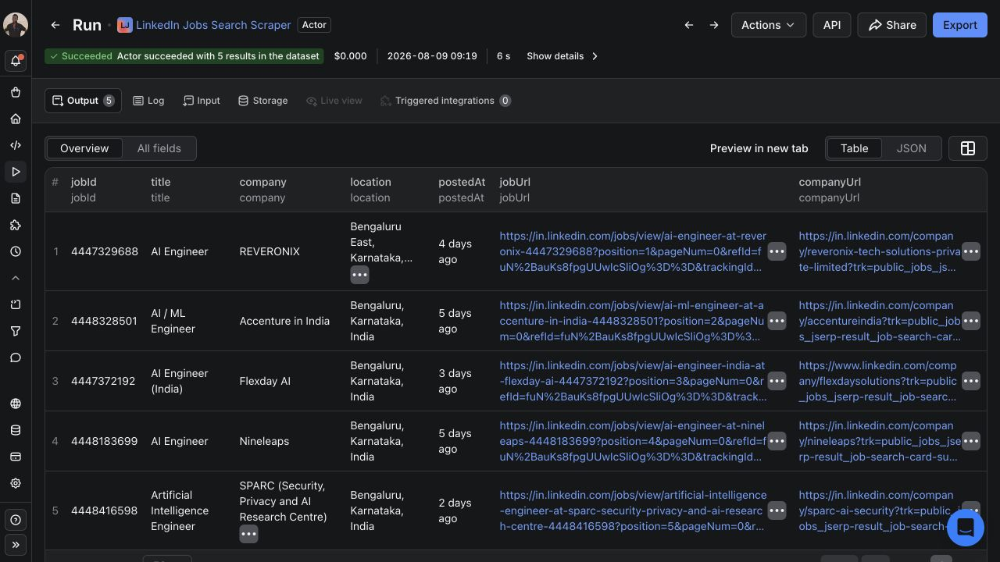
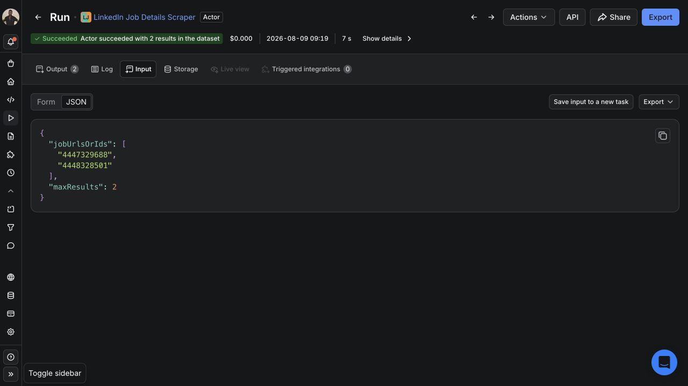
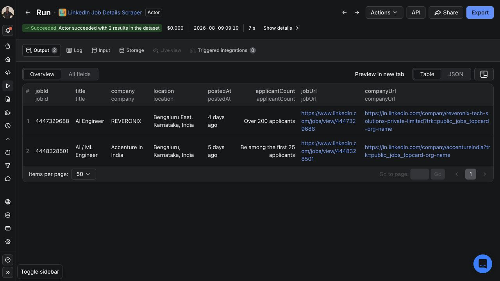

# Neuton recruiting research agent with Apify MCP

This is the tested companion project for the Neuton Apify Content Program article. It is intended for developers who are new to Apify but already comfortable with Node.js, JSON, and environment variables.

The companion is a deterministic MCP client, not an autonomous language-model agent. It calls two Actor tools in a fixed order. Its brief reports literal term mentions with source excerpts; it does not infer hiring requirements or make candidate decisions. The original end-to-end run was verified August 9, 2026. The September 29 brief correction and September 30 resume support pass offline tests but have not been rerun against paid cloud Actors.

## Try one job before setting up MCP

You can check whether the data fits your workflow in Apify Console before installing this project. The [one-job example](https://apify.com/neuton/linkedin-job-details-scraper/examples/sample-linkedin-job-details-scraper-description-extract?utm_source=github&utm_medium=referral&utm_campaign=neuton_mcp_first_job_20260929&utm_content=readme_example) searches for one current public data-engineer role in London. It is a runnable input, not a pre-generated sample dataset or a guaranteed available job.

1. Review the [Actor's current pricing](https://apify.com/neuton/linkedin-job-details-scraper?utm_source=github&utm_medium=referral&utm_campaign=neuton_mcp_first_job_20260929&utm_content=readme_actor), account charges and input before starting. Keep `maxResults` at `1`; a result limit is not a dollar spending cap.
2. After a successful run, open the Dataset and compare the job URL, title, company and description with the public listing. Keep missing optional fields, including salary, empty rather than guessing.
3. Export JSON or CSV once the row is useful. For recurring spreadsheet work, follow the [LinkedIn jobs to Google Sheets guide](https://neuton.online/guide-linkedin-jobs-google-sheets?utm_source=github&utm_medium=referral&utm_campaign=neuton_mcp_first_job_20260929&utm_content=readme_sheets). Its starter is inactive; Google Sheets delivery must be validated in your own account before scheduling.

If the run fails or returns no complete row, inspect that run's free `RUN_SUMMARY` diagnostics before retrying. A failed fetch does not mean the job was removed. You do not need a LinkedIn login for this public-job workflow; an Apify account is required and charges may apply.

Continue below when you want to connect the two Actors through MCP. This repository does not collect private profiles or rank candidates for employment decisions.

## Prerequisites

- Node.js 22 or newer.
- An Apify account.
- An Apify API token from **Apify Console > Settings > Integrations**.

## Install

```bash
npm install
```

## Inspect the Actor tools

Set your token in the shell without committing it:

```bash
export APIFY_TOKEN="your-token"
npm run inspect
```

This prints the MCP tool names and input schemas exposed for the two Neuton Actors.

## Run the two-Actor workflow

```bash
npm start
```

The script:

1. Calls the LinkedIn Jobs Search Actor through MCP for five recent Bengaluru AI roles.
2. Reads the default dataset through the MCP `get-dataset-items` tool.
3. Passes two returned job IDs to the LinkedIn Job Details Actor.
4. Reads the enriched dataset and writes `run-output.json`.

Successful output includes both run IDs, both dataset IDs, the selected records, and a short evidence-based brief. A terminal failure reports its run ID and status, then stops for inspection in Apify Console.

### Resume without launching another paid run

The script records each start in `.neuton-run-checkpoints/` before calling the Actor, then saves the returned run ID. This folder contains run identifiers and an input fingerprint, not your API token or scraped records. Keep it private; it is excluded from Git.

A 30-second MCP wait is not the Actor's execution timeout. This example polls the same run a bounded number of times. If it is still active, `npm start` exits with its run ID instead of treating it as failed or aborting it. Run `npm start` again from the same directory to resume. A completed search is reused when only the details step needs to finish, and a completed workflow reads the same datasets again rather than buying another scrape.

If the connection fails during the initial start before a run ID is saved, the script stops with an ambiguous-start warning. Check **Apify Console > Runs** before doing anything else. Do not delete the checkpoint or retry through a fresh directory: the original run may already be billable. Failed, aborted and timed-out runs also stop rather than restart automatically. A polling connection error preserves the known run ID and can be retried with `npm start`.

For an intentional fresh scrape, first confirm both recorded runs are terminal in Console, preserve their output and archive the checkpoint folder. Only then start a new workflow and review current pricing. Changing inputs while keeping an old checkpoint is rejected. Never run concurrent copies to try to speed it up.

This prevents automatic duplicate starts within the same checkpoint directory. It is not server-side exactly-once execution, a dollar spending cap, or protection if the checkpoint is lost. See [Apify's MCP run and result documentation](https://docs.apify.com/integrations/mcp).

The brief includes `observedTerms` with posting counts, job URLs and excerpts. A mention can be negated or optional; do not treat it as a verified skill requirement. Missing, duplicate, unrelated or incomplete enriched records stop brief generation. Historical fixed sample claims are no longer emitted. Run `npm test` for the offline checks; they make no network requests or paid Actor calls.

## Verified workflow screenshots







## First-run troubleshooting

- **`MCP error -32000: Connection closed`**: launch the package's declared executable entry point, `dist/stdio.js`, rather than importing its library entry point.
- **No Actor tool appears**: confirm the Actor full name in `src/mcp-client.mjs` and run `npm run inspect`.
- **Authentication fails**: check that `APIFY_TOKEN` exists in the same shell that runs `npm start`.
- **The search returns zero rows**: broaden the date window or location, but keep `maxResultsPerQuery` small while testing.
- **A run remains active**: keep `.neuton-run-checkpoints/` and rerun `npm start` to resume the recorded run. Do not launch the Actor manually as a retry.

## Safety and cost

The example limits the search to one keyword, one location, and five rows. Do not remove result limits until you have verified the workflow and understand the Actor pricing shown in Apify Store.

Never commit `.env` or an Apify API token. Use only public job information and follow applicable platform terms, privacy rules, and local laws.

## Dependency audit note

`npm audit` currently reports four moderate findings that trace to `@hono/node-server` below 2.0.5 through the pinned Apify MCP server dependency. The advisory concerns encoded-backslash path traversal in Windows static-file serving. This companion uses the local MCP standard-input/output transport and does not serve static files, so that vulnerable path is not exercised here. Recheck the audit when updating `@apify/actors-mcp-server`; avoid forcing a transitive major-version override without retesting the MCP workflow.
